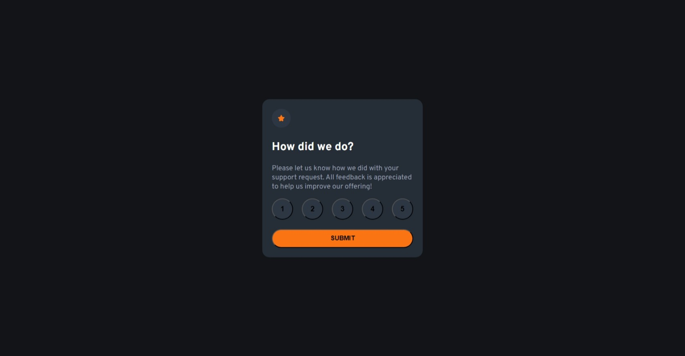
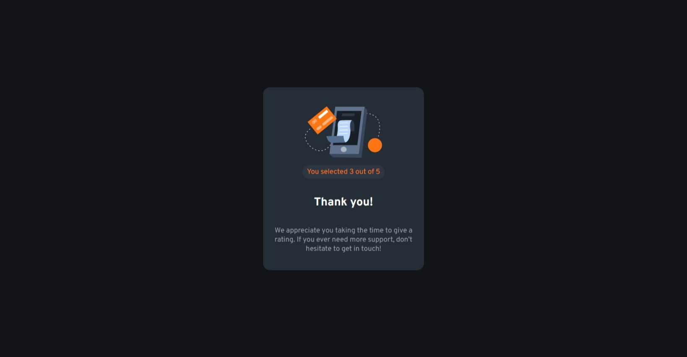

# Frontend Mentor - Interactive rating component

## 1. Overview

The challenge is to build out this **Interactive rating component** and get it looking as close to the design as possible.

Users should be able to:
- Select and submit a number rating.
- See the "Thank you" card state after submitting a rating
- See hover and focus states for all interactive elements on the page


### a) My screenshot




### b) Links

- Solution URL: [my source code here](https://github.com/hieutrantrong21520859MMCL21/FrontEndPractice_Intern_InteractiveRatingComponent)
- Live Site URL: [my website's URL here](https://hieutrantrong21520859mmcl21.github.io/FrontEndPractice_Intern_InteractiveRatingComponent/)

## 2. My process

### a) Built with

- HTML
- CSS
- JavaScript
- Mobile - first workflow

### b) What I learned

- How to create circular buttons.
- How to open a pop - up using *click* effect.
- Some codes I am most proud of (which consist of knowledge I have learned):

```javascript
const rating_box = document.querySelector('.rating-box');
const pop_up = document.querySelector('.pop-up');
const submit_btn = document.getElementById("submit");
const rating_buttons = document.querySelectorAll('.rating-box ._button button');
const result = document.getElementById('result');

// Click on button 'Submit'
submit_btn.addEventListener('click', function() {

    pop_up.classList.remove('hidden');
    rating_box.classList.add('hidden');
});

// Click on pop - up to close it
pop_up.addEventListener('click', function() {

    if (!pop_up.getAttribute('class').includes('hidden'))
    {
        pop_up.classList.add('hidden');
        rating_box.classList.remove('hidden');

        // Reset the rating
        result.innerHTML = "";
    } 
});

// Get number from the clicked button
rating_buttons.forEach(btn => {
    
    btn.addEventListener('click', function() {

        result.innerHTML = btn.innerHTML;
    })
})
```

### c) Useful resources

- [MDN - HTML](https://developer.mozilla.org/en-US/docs/Web/HTML): this helped me a lot about HTML via articles.
- [Learn HTML](https://web.dev/learn/html): this is an amazing website that provides lessons about HTML with examples.
- [MDN - CSS](https://developer.mozilla.org/en-US/docs/Web/CSS): this helped me well with CSS via articles.
- [Learn CSS](https://web.dev/learn/css): this is an amazing website that provides lessons about CSS with examples.
- [MDN - JavaScript](https://developer.mozilla.org/en-US/docs/Web/JavaScript): this website a lot of useful articles.
- [javascript.info](https://javascript.info/): this website provides lots of lessons and detailed explanation.
